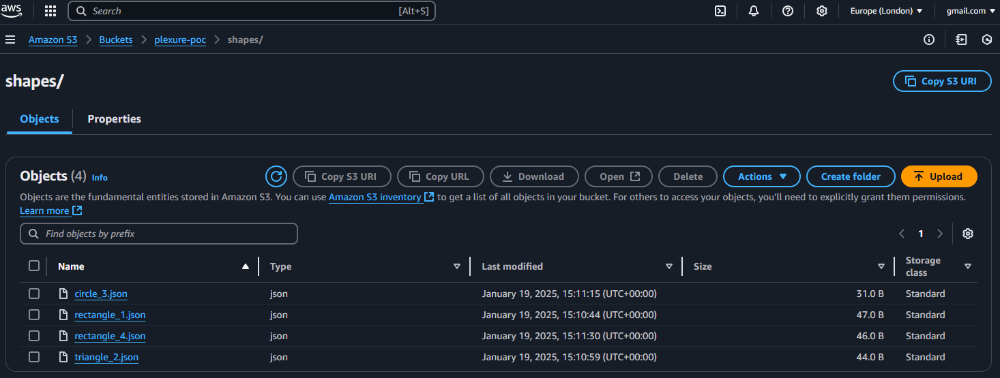
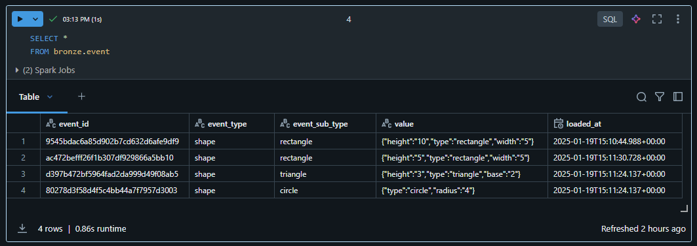
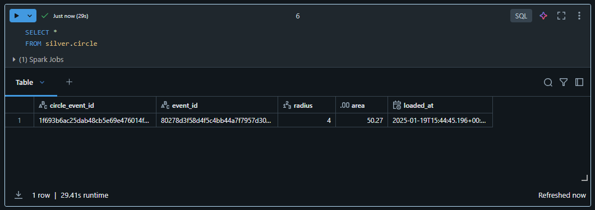
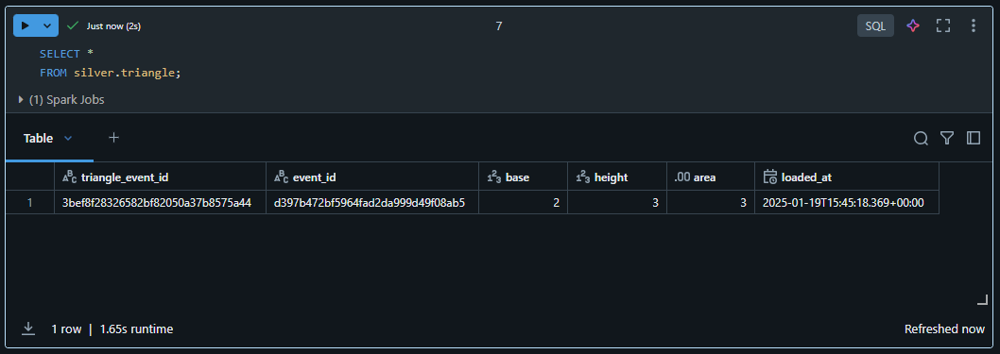
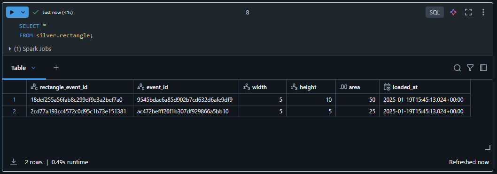
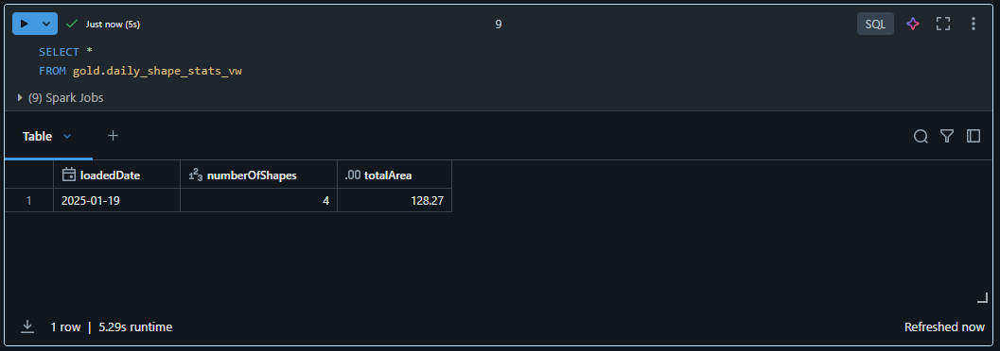
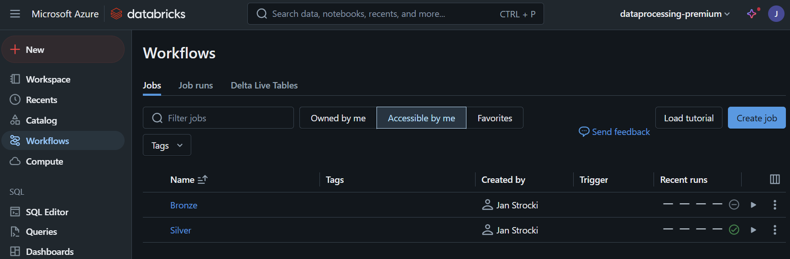

# Introduction 
This project implements a scalable data pipeline for processing, transforming, and analyzing streaming shape data using a combination of the Medallion (Bronze-Silver-Gold) and Multiplex architectures within a Databricks environment (because of the time constraints I didn't fully setup my local env to run all of the code in this repo locally).

For the purposes of this POC, a function immitates streaming and storing data in S3 bucket (poc_s3_feed\send_json_to_s3_bucket.py):

From the S3 bucket, the raw streaming data is ingested into a single Bronze table. It's stored in its original format (JSON) in 'value' column of the table. The goal is to store it as-is, preserving all the records for later transformation. In a multiplex architecture, streaming all data into a single table allows to utilize rosources more efficiently (computating is used optimally, as there is no need to duplicate or manage multiple streaming pipelines).

Further down, the data is separated by shape type into separate Silver tables, and aggregated in the gold layer for analytics. This step (in line with the multiplex architecture) is done as a batch (can also be as a micro-batch) as it allows to perform more complex transformations, de-duplications, and enrichment easier than if the data was streamed.

In the final, Gold layer, for the purposes of this POC the data is aggregated in a single view. In a real project, a view may not be an ideal solution - depending on the volumes of data and required transformation, data might be better stored in a physical table.

From the coding perspective, the project applies a modular Strategy Design Pattern for shape processing, leveraging a dedicated processor for each shape type (e.g., circles, rectangles, triangles). This approach ensures maintainability, extensibility, and clear separation of concerns. 

Below are the snapshots of what the data looks like in Databricks.

1) Bronze

2) Silver

3) Gold

# Getting Started
The code runs in Databricks only. Local setup is out of scope for this assignment.

Automated deployment (CI/CD) is also out of scope. The code runs in Databricks because I linked the repo manually.

In Databricks, there are two seperate pipelines (also created manually): Bronze (intended to run continually) and Silver (intended to run as a batch):

# Build and Test
Out of scope for this POC.
